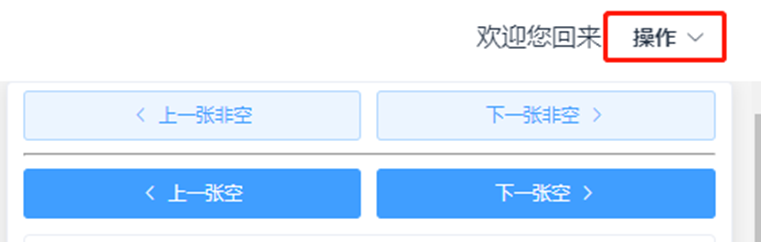
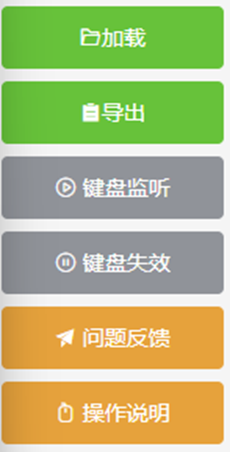
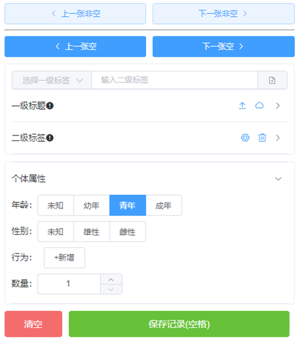

==================
界面说明
==================

.. note:: 此系统分为四个区域，左侧区域为 **分拣系统功能区** ，**中间为视图区**，右边为 **分拣操作区**，上方为 **界面导航区**。

1. 界面导航区
~~~~~~~~~~~~~~~
- 界面导航区可以跳转到主页和个人中心

- 如需修改密码等个人信息，点击右上角的“操作” -> "修改密码" 进行操作。

|

2. 分拣功能区
~~~~~~~~~~~~~~~~~~~
- 左侧分拣系统功能区的功能有图片文件夹加载、结果导出，快捷键开关控制。

|

3. 视图区
~~~~~~~~~~~~~~~~~~~~~~~~~~~
- 中间视图区的下方可以查看图片的个数，翻页以及图片页码的跳转。

|

4. 分拣操作区
~~~~~~~~~~~~~~~~~~~~~~~~~~~

- 右侧分拣操作区主要功能为图片的跳转，标签和属性的的编辑、添加、选择和修改。

