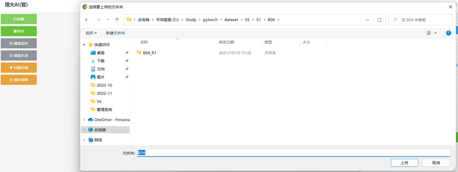
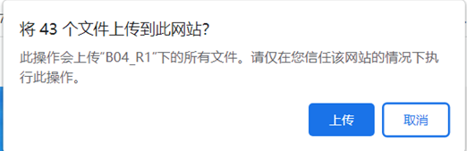
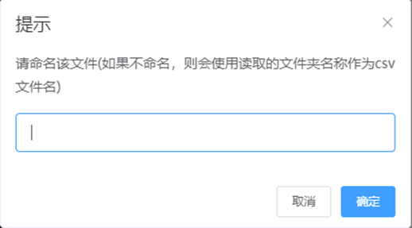
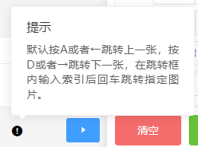
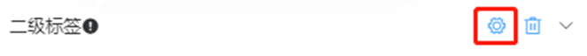
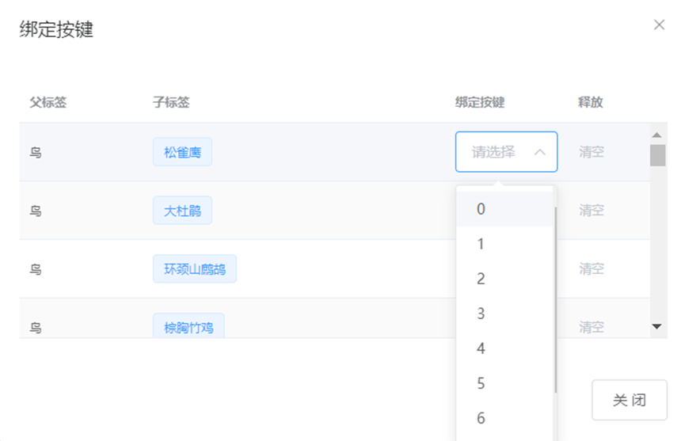

========================
分拣功能区操作
========================

|

1 加载
~~~~~~~~~~~~~~~~~~~~~~

- 点击 **加载** 按钮，选择本地的文件夹，系统会请求确认，点击上传即可将文件夹中的图片全部上传到系统中，如下图所示。

|

|

|

2. 导出
~~~~~~~~~~~~~~~~~~~~~~~~

- 用户点击右侧 **导出** 按钮，系统会请求重命名文件，如果没有命名则默认生成读取文件夹的名称作为csv文件名，如下图所示，点击确认后系统会将生成的CSV文件下载至本地。

|

3 键盘监听
~~~~~~~~~~~~~~~~~~~~~~~~~~~~~~~~~~

- 用户点击 **键盘监听** 按钮则为打开快捷键功能，具体的快捷键如下图所示，用户可根据自己的需求修改快捷键，也可以使用系统默认的快捷键，点击 **键盘失效** 按钮即可取消快捷键功能

|

|

|

4. 问题反馈
~~~~~~~~~~~~~~~~~~~~~~~

- 用户在使用过程中如果对系统的功能有所建议，或者遇到系统bug等问题，可以点击 **问题反馈** 按钮，根据提供的邮箱联系我们，我们将及时根据反馈做出调整。

|

.. tip:: 可通过点击右侧 **操作说明** 按钮查看简易版操作说明。

