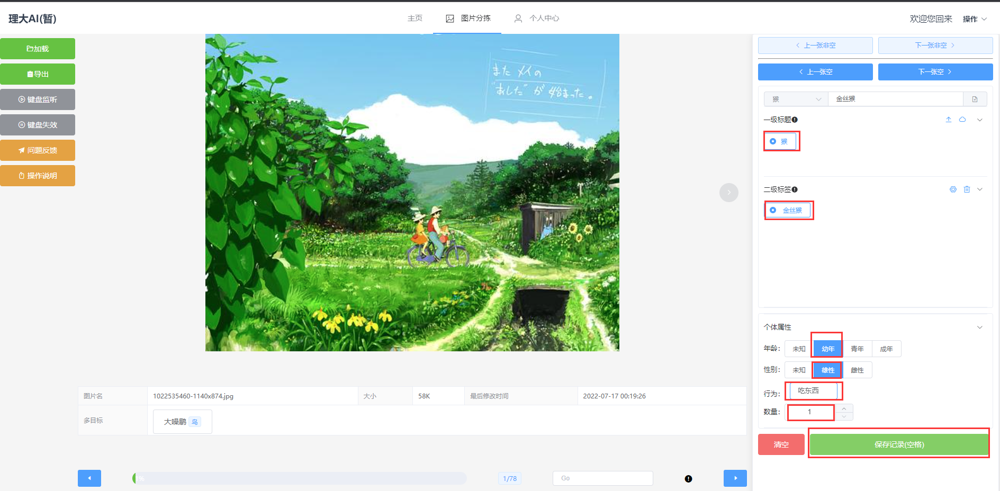

=============
快速开始
=============

1. 访问网站
~~~~~~~~~~~~~~~~~~~~~~
.. code-block:: text

    网址：eye1218.top

|

2. 登录
~~~~~~~~~~~~~~~~~~~~~~
.. attention:: 登录注册功能暂未开放，可跳过此步骤。

|

3. 进入图片分拣页面
~~~~~~~~~~~~~~~~~~~~~~

|

4. 导入图片
~~~~~~~~~~~~~~~~~~~~~~

|

1. 点击右侧加载按钮
------------------------

|

2. 在弹出的目录选择框中选择图片所在目录后，点击上传
-----------------------------------------------------------

|

5. 打标签
~~~~~~~~~~~~~~~~~~~

1. 手动新建标签
-----------------------

.. note::
    新建标签支持两种方式：**手动输入** 和通过 **csv文件导入**

- 如图下图所示，在框中输入内容后点击回车

|

2. 为图片打标签
-----------------------------

- 如下图所示，为图片选择标签后，点击保存**记录按钮**，生成一条记录

|

3. 切换图片
----------------

|

6. 导出结果
~~~~~~~~~~~~~~~~~~~~

- 点击页面右侧 **导出** 按钮，根据提示完成导出

