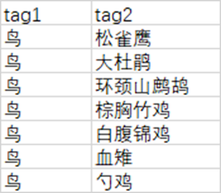

====================
分拣区操作
====================

- 分拣区最上方的按钮会根据用户之前标记的空和非空照片进行跳转，点击上一张非空会跳转到上一个标记过的图片，点击上一张空会跳转到上一个没有标记过的图片，如图所示。

|

- 中间标签栏的一级标题中可以上传本地的标签组的csv文件。

|

- csv需要预先处理成类似如下格式（其中tag1对应一级标题，tag2对应二级标题）。

|

- 导入后则根据csv文件自动生成对应的一级标题和二级标题。

|

- 也可以手动添加一级标题和二级标题，步骤如下：

a. 在选择一级标签这里输入要添加的一级标签，并回车确认。

|

b. 在输入二级标签这里输入要添加的二级标签，并点击后方图标确认。

|

c. 添加成功后在下方一级标签和二级标签处可以找到

|

d. 二级标签处有个删除选项，点击此可以删除指定的一级标签或二级标签，支持全选

|

.. note::
    1. 直接选择二级标签，系统会自动帮你选择一级标签
    2. 如果选择一级标签，非此一级标签对应的二级标签不可选中
    3. 再次点击该一级标签会取消一二级标签的选中状态

|

-  下方个体属性栏中，用户可以选择目标的年龄、性别、行为和数量，也可以新增行为，点击行为右边的新增，在输入框中输入新的行为后按下回车即可，在行为栏中可以点击自定义行为右上角的×对行为进行删除。

|

- 如果全部标签和属性选择完，点击保存记录（或按空格）后，在视图的下方多目标处会出现保存的结果。

|

- 如果同一个图需要添加多个结果，则需要再次点击多目标中原来的结果，取消选中，然后在保存新的结果，否则系统默认会用新的结果覆盖掉之前的结果。

|

- 点击清空按钮会删除掉多目标中选中的结果

