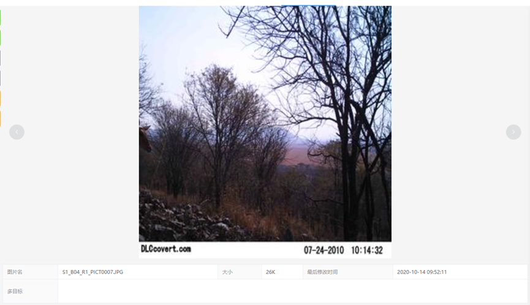
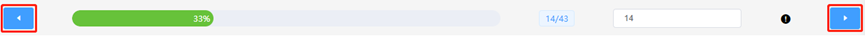

=========================
视图区操作
=========================

- 用户打开文件夹后，上方会显示图片，图片下方会显示图片的名称，最后修改时间以及图片大小。图片的左右两侧有翻页按钮，如下图所示。

|

- 视图区的下方进图条会显示当前图片占全部文件的比例。

|

- 右侧有图片跳转区，输入图片位置，按下回车即可实现指定位置的图片跳转。

.. image:: _static/images/view_3.png
    :align: center

|

- 左右两侧也可以实现上一张图片和下一张图片的翻页。

